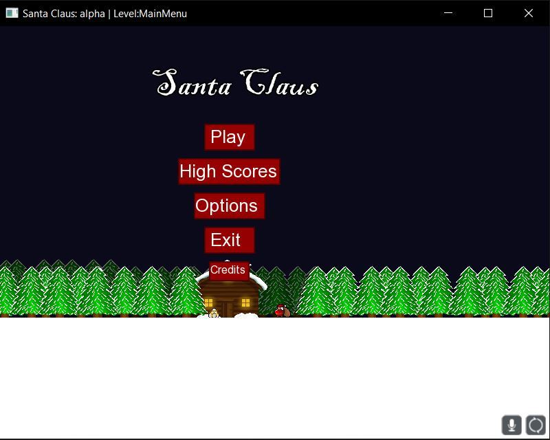
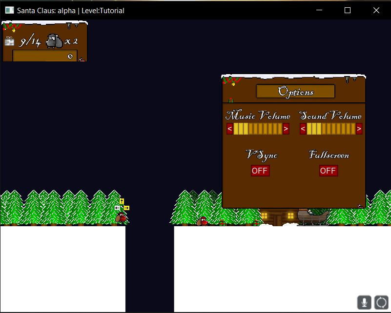
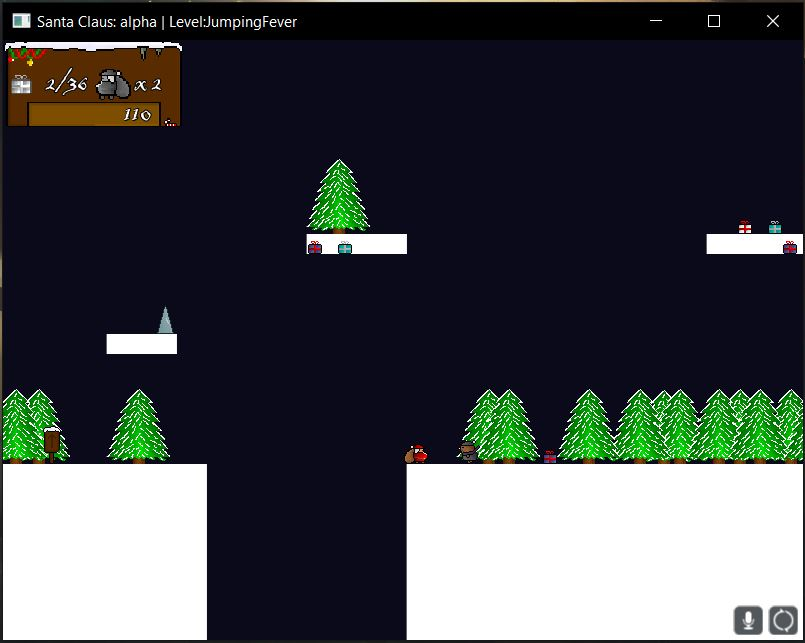
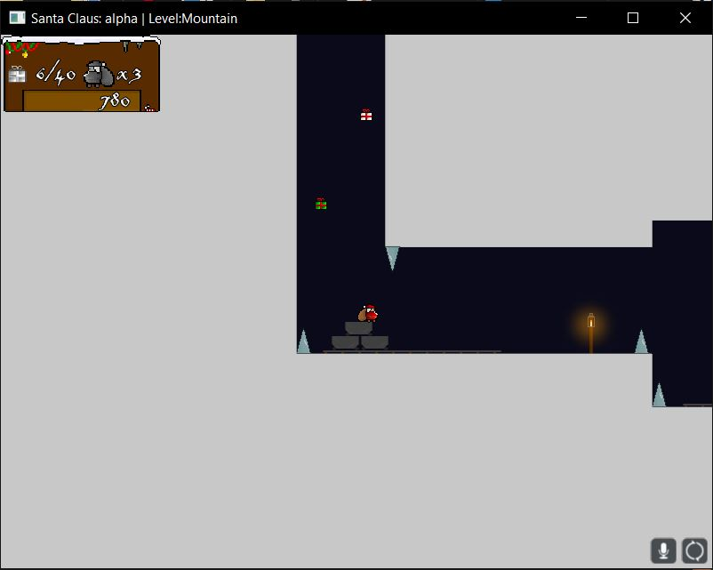

# Santa Claus
Santa Claus pelissä pääset olemaan joulupukki, joka on hukannut lentomatkalla reestään lahjapaketteja ympäri maailman. 
Löydä kaikki lahjapaketit ennen joulua, niin ansaitset täydet pisteet. Saatat hyvin pian huomata, ettei paikalliset aikuiset joulupukista tykkää, joten vältä heihin ja ansoihin törmäämistä.

## Projektista
Santa Claus peli on lähes ensimmäisiä harraste projektejani, joten koodi on mitä on ja kaikki on vähän miten sattuu. 
Olen kuitenkin erittäin tyytyväinen projektiin vielä tänä päivänä, koska sain tehtyä silloin yllättävän hyvin toimivan ja lähes "valmiin" pelin.

#### Idea & historiaa
Projektin idea lähti vuonna 2013 liikelle ihan vain, koska halusin tehdä jollakin tavalla oman pelin, jossa on itse luodut grafiikat ja koodi. Olin tuolloin hyvin nuori, joten tietämys ohjelmoinnista, suunnitelusta ja grafiikoista oli lähes olematon. Vuonna 2016 tein ensimmäisen demon pelistä ja silloiset ammattikoulu luokkalaiset olivat testi henkilöinä. Heidän mielestään peli oli todella hieno ja siisti. Syksyllä 2017 kyseltiin tuleeko uusi versio Santa Claus pelistä ja luokkalaisteni kyselyistä päätin kokeilla tehdä uuden paremman version.

Projektin aloitus nimi oli vitsikkäästi CyperClaus, koska kaverini muokkasi edellisenä vuonna 2016 tehdyn Santa Claus pelin pelattavan hahmon kyborgiksi,
joten nimi viitteitä CyperClaus:iin saattaa esiintyä kansioiden nimissä, sun muualla.

## Teknologia
#### Käytetyt kirjastot:
- [SFML](https://www.sfml-dev.org)

#### Kielet:
- C++

#### IDE - Ohjelmointiympäristö:
- [Visual Studio 2017](https://visualstudio.microsoft.com)

## Kuvakaapauksia:
| Päävalikko | Asetukset |
| --- | --- |
|  |  |

| Taso 2 | Taso 4 |
| --- | --- |
|  |  |

## ZIP-Lataus
lataa [tästä](https://users.metropolia.fi/~leevikos/downloads/SantaClaus%20-%202017.zip) .zip joka sisältää exe tiedoston ja siihen kuuluvat resurssit.

Pura zip ja varmista että koneessa on Microsoft Visual C++ 2015-2019 Redistributable laajennukset. Ohjelma ei asenna itseään ja ei asenna mitään, eikä sen pitäisi pyytää.

## Tekijät:
Ohjelmointi, grafiikka ja suunnittelu
- [Leevi Koskinen](https://github.com/leba9999)

Grafiikka ja taso suunnittelu/kehitys
- Mikael Ronkainen
